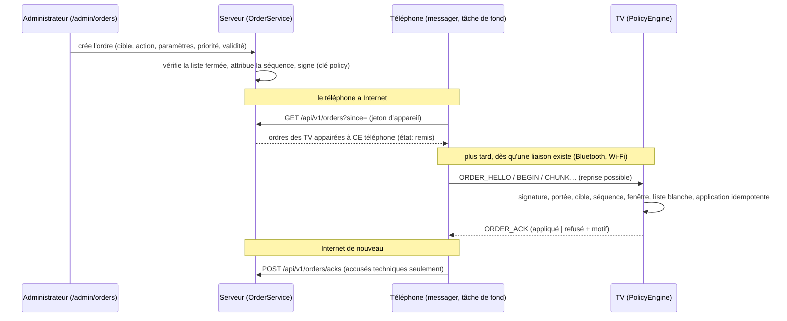
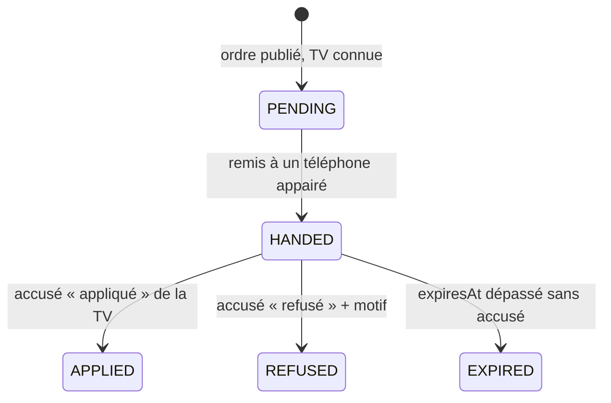
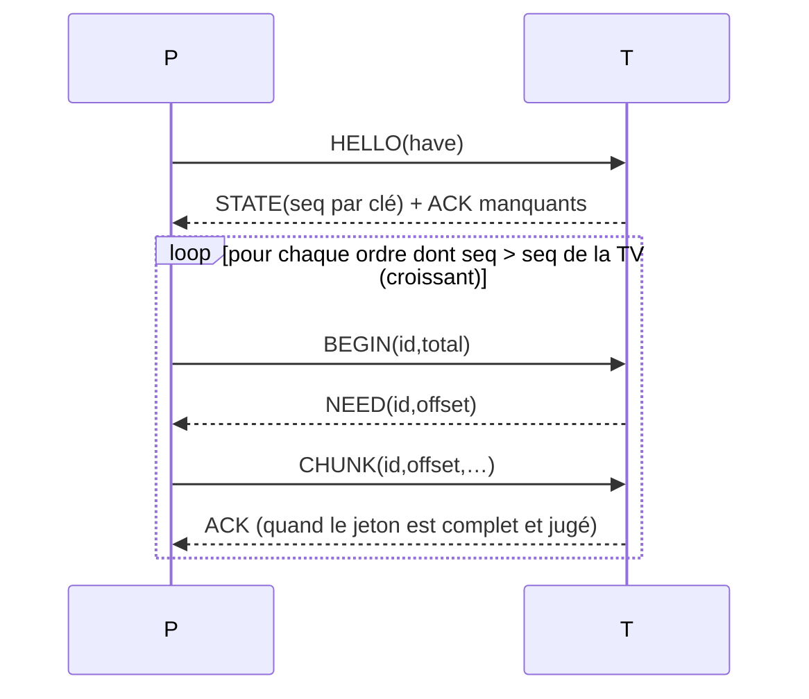

# Ordres différés : le serveur gère, le téléphone transporte, la TV applique

> Cahier : [agent-briefs/deferred-orders.md](agent-briefs/deferred-orders.md) · format filaire commun : [ACTIVATION-FORMAT.md](ACTIVATION-FORMAT.md) § 3 (enveloppe `cbx1`, type `order`) · livraison différée des lots : [LOTS.md](LOTS.md) · liaison Bluetooth : [BT-PLUG-AND-PLAY.md](BT-PLUG-AND-PLAY.md).
> **Décision du propriétaire** : l'application TV est surtout hors ligne ; un service d'administration, inaccessible à l'utilisateur, transmet les ordres de gestion du serveur et applique **en différé** les politiques par l'**application téléphone** (souvent en ligne, souvent près de la TV), qui n'est que le **messager**.
> **Aucun second format** : les ordres sont des enveloppes `cbx1` ordinaires (`type=order`, portée de clé `policy`). Ce document ne définit que le **corps**, la **liste fermée d'actions**, les **états**, les **routes** et les **trames Bluetooth**.

## 1. Vue d'ensemble

Principe de sûreté : **la TV est la seule à décider**. Le serveur ne signe que la liste fermée ; le téléphone ne peut rien changer (signature) ni inventer ; la TV re-vérifie tout et applique un ordre **valide**, **destiné à elle**, **dans la portée de sa clé**.

## 2. Garde-fous (un canal de contrôle à distance doit être étroit)
| Garde-fou | Où il est appliqué | Test |
|---|---|---|
| **Jeu d'actions fermé** (liste blanche, § 4) ; identifiant hors liste = refus même signé | serveur (`PolicyCatalog`) **et** TV (`PolicyActions`), listes comparées à `tools/orders/actions.json` | `ActionsParityTest`, `OrderEnvelopeTest`, `anActionOutsideTheWhitelistIsRefusedEvenSigned` |
| **Jamais** : exécution de code, accès/lecture/suppression des fichiers ou de la bibliothèque, données personnelles, accès distant, désactivation de la mise à jour signée | aucune action n'existe ; la liste `NEVER` est refusée et testée | idem |
| **La suspension ne ramène qu'à l'état verrouillé** (activation seule autorisée), n'efface **rien** et se lève par `license.activate` | `PolicyGate` | `suspensionOnlyLocksAndNothingIsDeleted` |
| **Portée des clés** : la clé serveur a `policy` mais ni `transfer` ni `open` ; un ordre ne peut jamais accorder plus que sa clé (prolonger = `issue_production`, révoquer = `revoke`, révoquer une clé **plus puissante** que soi est refusé) | TV | `anOrderNeverGrantsMoreThanItsKeyScope`, `theServerKeyCannotRevokeTheOwnersMasterKey` |
| **Aucune donnée personnelle** dans les ordres ; le téléphone n'envoie que code d'appareil, clé, séquence, résultat, version de politique | format des paramètres + `OrderAck` | `ackWireTextRoundTrips`, `phoneFetchesOnlyItsPairedTvs…` |
| **Pas de « brique »** : sans ordres, la TV garde son dernier état valide ; les expirations de droits restent locales (dates) ; une panne du serveur ne verrouille personne | aucun minuteur dans le moteur | `noOrdersForAYearChangesNothing` |
| **Transparence** : journal local **en lecture seule** (À propos > Politiques appliquées) + avis d'usage au premier lancement (§ 11) | `PolicyEngine.journal()`, `PolicyHub.journalLines()` | `refusedThenFollowingOnesApplied` |
| **Audit serveur chaîné** pour chaque ordre créé, publié, remis, accusé | `order_audit` (empreintes chaînées) | `auditChainIsIntactThenDetectsATamperedLine` |
| **Interrupteur** : service éteint par défaut (`CASTBRIDGE_ORDERS_ENABLED=true` **et** clé de signature) | serveur | routes 404/503 tant qu'éteint |
| **Aucune interface** pour l'utilisateur côté téléphone ; **aucun nouveau canal** (service Bluetooth propriétaire existant `…0005`, trames additives) | téléphone | — |

## 3. Format : l'enveloppe `cbx1`, type `order`
Voir [ACTIVATION-FORMAT.md § 3.4](ACTIVATION-FORMAT.md). En-tête : `kid`, `seq` (numéro **par clé**), `nonce`, `issuedAt`, `notBefore`, `expiresAt`, `target` (`any` | `device` + `k` + facteurs | `license:<id>` | `group:<id>`). Corps : `action=<id>` puis `param=<nom>|<valeur>` triés (≤ 16 paramètres, valeur ≤ 512 caractères sans saut de ligne).
- **Taille** : la TV refuse un jeton de plus de 4 000 caractères (`TOO_LARGE`) ; au-delà d'un bloc (1 024 caractères) le jeton voyage en plusieurs blocs.
- **Octets identiques** : le serveur (Java `OrderEnvelope`), le noyau (Kotlin `Orders.issue`) et le vérificateur Python produisent les mêmes octets (vecteur partagé `build-order-any` + chaîne de référence « cible appareil » testée des deux côtés).
- **Séquence** : le serveur attribue les numéros **consécutifs au moment de la signature**, dans l'ordre voulu d'application (priorité décroissante, puis ancienneté), sous verrou (`order_key_seq … for update`) : deux publications simultanées ne donnent jamais le même numéro (testé). Les numéros commencent à **1** (la TV exige `seq` > dernier vu, 0 au départ).

## 4. Actions autorisées (liste fermée)
Toutes sont des affirmations **absolues** (« cette licence est suspendue »), jamais des deltas : appliquer deux fois donne le même état.

| Action | Paramètres | Effet sur la TV | Portée de clé en plus de `policy` |
|---|---|---|---|
| `license.suspend` | `license` | licence suspendue → application **verrouillée** (rien n'est supprimé) | — |
| `license.revoke` | `license` | idem, libellé « révoquée » | — |
| `license.activate` | `license` | lève une suspension/révocation de politique | — |
| `license.extend` | `license`, `until` (ms ≤ maintenant + 366 j) | prolonge la **fin** d'un droit existant ; ne crée jamais un droit, ne raccourcit jamais | `issue_production` |
| `revocation.add` | `kid` **ou** `license` + `seat` + `at` | alimente la liste de révocation (clés, postes) | `revoke` (et on ne révoque pas une clé plus puissante que soi) |
| `rights.refresh` | `reason` (≤ 64) | demande à l'application de rafraîchir ses droits (lien par le téléphone) | — |
| `flag.set` | `name` ∈ {`learn.beta`, `quiz.beta`, `bt.tunnel`, `lots.autodownload`, `telemetry.verbose`, `ui.new-home`}, `value` 0/1 | indicateur de fonctionnalité (**jamais** de sécurité : pas d'indicateur pour la mise à jour signée) | — |
| `app.min_version` | `version` | version minimale conseillée (invite à mettre à jour ; **ne verrouille pas**) | — |
| `update.channel` | `channel` ∈ {`stable`, `beta`} | canal de mise à jour (la vérification de signature reste inchangée) | — |
| `catalog.available` / `catalog.retire` | `lots` (≤ 24 `fonction:portée`) | lots à proposer / à **retirer du magasin de lots** (jamais les fichiers de l'utilisateur) | — |
| `budget.set` | `name` ∈ {`lots_mb` 0–100 000, `starter_mb` 0–10 000, `quiz_daily` 0–10 000}, `value` | budgets/quotas | — |
| `message.show` / `message.clear` | `id`, `text` (≤ 280, **texte brut, aucun lien**), `level` (`info`/`notice`), `until` | message d'information à l'utilisateur | — |

Refus typés (`AckReason`) : `UNKNOWN_ACTION`, `BAD_PARAMS`, `SCOPE_EXCEEDED`, `TOO_LARGE`, et les refus génériques de l'enveloppe (`MALFORMED`, `UNKNOWN_TYPE`, `UNKNOWN_KEY`, `REVOKED_KEY`, `BAD_SIGNATURE`, `KEY_NOT_ALLOWED`, `BAD_ORDER`, `WRONG_TARGET`, `STALE_SEQUENCE`, `NOT_YET_VALID`, `WINDOW_CLOSED`).
Ajouter une action = mettre à jour `PolicyActions` (Kotlin), `PolicyCatalog` (Java), `tools/orders/actions.json`, ce tableau et les tests : un test échoue si les listes divergent.

## 5. États
Un ordre côté serveur : `QUEUED` (retenu, non signé) → `RELEASED` (signé) → `CANCELLED` ; `EXPIRED` se déduit de la date. Pour **chaque TV** :

Correspondance avec le cahier : *en attente* = `QUEUED`/`PENDING`, *remis au téléphone* = `HANDED`, *accusé par la TV* = `APPLIED` ou `REFUSED` (le résultat dit lequel), *expiré* = `EXPIRED`. Le **premier** accusé gagne (un accusé contradictoire ultérieur est ignoré). Les remises sont créées **à la remise** : pour une cible large (tous, licence, groupe) le serveur ne suit que les TV qu'il connaît (appairées).

## 6. Serveur (`backend/…/orders`, migration `V60__deferred_orders.sql`)
- **Création** : `/admin/orders` (page, CSRF, CSP stricte) ou `POST /api/v1/admin/orders` (jeton d'administration). Le serveur **refuse** toute action hors liste ou à paramètres invalides (400), une cible `device` inconnue (la TV doit avoir été appairée par un téléphone), une validité hors 1 h–366 j. Option **retenir** : plusieurs ordres sont préparés puis publiés ensemble (`POST …/release`), signés par priorité.
- **Routes du téléphone** (jeton d'appareil, appareil non bloqué, application téléphone, **404 tant que le service est éteint**) :
  - `POST /api/v1/orders/pair` `{"deviceInfo": "<demande d'appareil de la TV>"}` : enregistre la TV (code + facteurs hachés ; le serveur **recalcule le code** et refuse l'incohérence) et l'appairage téléphone↔TV ;
  - `GET /api/v1/orders?since=<curseur>` → `{"cursor":n,"orders":[{"id","tv","token"}]}` : **uniquement** les ordres des TV appairées à ce téléphone, non expirés, non déjà accusés ; le curseur n'avance jamais au-delà d'un ordre retenu non encore publié (aucun ordre n'est sauté) ; une remise plus ancienne qu'une heure sans accusé est renvoyée (téléphone ayant perdu ses données) ;
  - `POST /api/v1/orders/acks` `{"acks":[{"tv","ack"}]}` : accusés **techniques** ; ignorés si la TV n'est pas appairée à ce téléphone ou si l'ordre est inconnu ; idempotent.
- **Appartenance licence/groupe** : table `order_membership` (tenue par l'administration, `POST …/membership`) ; le module des licences (`license-admin`) la remplace par sa table de postes en implémentant la même résolution. Elle s'applique aux ordres publiés **ensuite**.
- **Clé** : `OrderSigner` (interface). Par défaut `ConfiguredOrderSigner` lit `CASTBRIDGE_ORDERS_KEY_FILE` (PEM/DER PKCS#8 ou base64 de la graine ; secret Docker, jamais dans l'image ni les journaux). Le module des licences peut fournir **sa** clé « serveur » (même `kid`) en déclarant son propre `OrderSigner` `@Primary`.
- **Audit** : `order_audit`, chaque ligne contient l'empreinte de la précédente ; `GET /api/v1/admin/orders/audit/verify` (et le bouton de la page) indique la première ligne altérée. À fusionner avec la chaîne d'audit du module des licences (même principe) lors de l'intégration.
- **Déploiement sûr** : migration additive (nouvelles tables seulement, V60 ; V50–V59 réservées aux licences), sauvegarder la base avant, interrupteur éteint par défaut, activer d'abord en préproduction (port 7091) avec une clé **de test**, retour arrière = remettre `CASTBRIDGE_ORDERS_ENABLED=false` (les tables restent, inertes).

## 7. Téléphone (messager) — `castbridge.core.policy` + `OrdersRuntime`
- **Tâche de fond** (`JobScheduler`, batterie non faible, sans interface ni notification) : synchronisation serveur toutes les 6 h (réseau quelconque) ; tentative de livraison toutes les 30 min (peu coûteuse si la file est vide). `OrderQueue` (persistante, même mécanique que `DeliveryQueue`) : un ordre = (TV, clé, séquence) ; ordre de livraison = séquence croissante par clé ; purge des ordres expirés depuis plus de 7 jours ; accusés conservés jusqu'à confirmation du serveur.
- Le téléphone **garde le jeton tel quel** et ne l'affiche jamais ; toute modification casse la signature (testé : un jeton falsifié est refusé **par la TV**, motif remonté au serveur). *Précision honnête* : la signature protège l'**intégrité** ; le contenu d'un ordre n'est pas chiffré (aucune donnée personnelle n'y figure, § 2).
- **Appairage** : au premier contact (trame `DEVICE_INFO` déjà existante) le téléphone retient la demande d'appareil de la TV et l'enregistre au serveur.

## 8. TV (moteur de politiques) — `PolicyEngine`
Ordre des vérifications (premier échec = motif, **les ordres suivants ne sont jamais bloqués**) :
1. taille ≤ 4 000 ; 2. décodage et forme canonique (`MALFORMED`) ; 3. type `order` ; 4. clé connue et non révoquée (anneau + révocations de politique) ; 5. signature ; 6. portée `policy` ; 7. schéma générique (`BAD_ORDER`) ; 8. **cible** : tout appareil, cet appareil (k parmi n), une licence **détenue**, un groupe **dont il est membre** ; 9. **séquence strictement croissante par clé** (`STALE_SEQUENCE`, anti-rejeu et anti-retour-arrière ; un trou est accepté ; un ordre refusé aux étapes 1–8 **n'avance pas** la mémoire) ; 10. fenêtre `notBefore` (tolérance 24 h) / `expiresAt` ; 11. **liste blanche** et paramètres (`UNKNOWN_ACTION`, `BAD_PARAMS`) ; 12. **portée supplémentaire** de l'action (`SCOPE_EXCEEDED`) ; 13. application **idempotente** à l'état et sauvegarde atomique (état, séquences, horloge, journal, accusés).
- **Horloge** : la TV hors ligne a une horloge peu fiable ; elle utilise `TvClock` (maximum de l'horloge, du dernier instant vu et du plancher) : une horloge **reculée** ne ressuscite jamais un ordre expiré (et le journal le note), un saut de plus de 400 jours n'est pas cru, une horloge à 1970 fait refuser (`NOT_YET_VALID`) sans rien casser. *Un ordre n'élève pas le plancher d'horloge* (un ordre venu d'un serveur compromis ne doit pas pouvoir faire « expirer » la TV).
- **Idempotence réseau** : le même jeton reçu deux fois (accusé perdu) renvoie **le même accusé** sans rien réappliquer ; seules les décisions prises sur une **signature vérifiée** sont mémorisées (une copie falsifiée de même `kid`/`seq`/`nonce` ne peut pas « empoisonner » le vrai ordre).
- **Persistance** : un petit fichier JSON atomique ; fichier abîmé = démarrage à vide, sans plantage.
- **Effets** : `PolicyState` (licences, prolongations, révocations, indicateurs, version minimale, canal, catalogue, budgets, messages) est **lu** par l'application ; `PolicyGate.effective` convertit une suspension en `GateState.Locked` **seulement si** toutes les licences installées sont suspendues, et seulement quand l'exigence d'activation est active.

## 9. Protocole Bluetooth (additif, rétrocompatible)
Canal propriétaire existant (service `7c5e3b9a-4d2f-4c61-9b0e-cb0000000005` = `OwnerFrames.SERVICE_UUID` : `…0004` est le tunnel API v2, la table des services est `BtProtocol.SERVICES` ; poignée `CBTO`, trames `[type:1][longueur:2][charge ≤ 4096]`), **nouveaux types 16 à 21**. Un ancien téléphone n'émet jamais ces types. Une TV dont le canal ne les traite pas (une ancienne, et aujourd'hui toute TV : `PolicyHub` n'est pas encore branché, § 13) **ne les ignore pas** : `OwnerChannelServer` répond `RESULT(0)` « Non pris en charge par cette TV » à tout type qu'il ne connaît pas ; le messager lit l'absence de `ORDER_STATE` après `ORDER_HELLO` comme « TV non prête » (`CourierResult.NotSupported`, les ordres restent en file). *Écart connu* : `OrderCourierTest` simule encore la TV ancienne par un canal qui **abandonne** le type sans répondre ; à aligner sur la réponse réelle lors du câblage (inventaire du relais, I-2 et M7).

| Type | Sens | Charge utile |
|---|---|---|
| 16 `ORDER_HELLO` | téléphone → TV | `have=<kid>:<seq>` : plus haut accusé déjà reçu par clé |
| 17 `ORDER_STATE` | TV → téléphone | `v=1`, `policyVersion=n`, `seq=<kid>:<dernier accepté>` ; puis un `ORDER_ACK` par accusé manquant |
| 18 `ORDER_BEGIN` | téléphone → TV | `id=<8 hex>` (empreinte du jeton), `total=<caractères>` |
| 19 `ORDER_CHUNK` | téléphone → TV | `id|offset|` + ≤ 1 024 caractères |
| 20 `ORDER_ACK` | TV → téléphone | texte d'`OrderAck` |
| 21 `ORDER_NEED` | TV → téléphone | `id|offset` : point de reprise (après `BEGIN`, ou bloc au mauvais décalage) |

Liaison coupée en route : l'ordre reste en file, la TV garde son bloc partiel et indique le point de reprise (si la TV a redémarré, le téléphone recommence l'ordre) ; un jeton complet dont l'empreinte ne correspond pas à `id` est jeté sans être jugé. Le **mode porteur** et le lien de confiance existants sont réutilisés (aucune nouvelle autorisation) ; le même `OrderLink` peut s'appuyer sur le tunnel Wi-Fi (`claude/bt-tunnel-keepalive`).

## 10. Tests (voir le rapport pour les comptes)
Rejeu · séquence en retard / en avance (trou) · clé hors portée · clé inconnue / révoquée · mauvaise cible (TV, licence, groupe) · ordre expiré / pas encore valable · horloge reculée, très avancée, à 1970 · ordre refusé puis suivants appliqués · interruption du transfert (reprise, TV redémarrée, accusé perdu) · ancien téléphone / ancienne TV · action hors liste blanche (16 identifiants interdits) · paramètres hors schéma (indicateur de sécurité, lien dans un message, prolongation « à vie ») · suspension sans perte de données et levée · jeton falsifié · activation présentée comme un ordre · persistance (redémarrage, fichier abîmé) · parité Kotlin/Java/Python (octets, code d'appareil, liste d'actions) · serveur : cycle complet, visibilité par téléphone, accusés idempotents, priorité, curseur, concurrence des numéros, appartenance, expiration, annulation, rôles, audit chaîné.

## 11. Transparence (texte à valider par le propriétaire)
La TV tient un **journal local des politiques appliquées**, lisible dans **À propos > Politiques appliquées** (lecture seule : aucune action, aucun bouton), et l'avis d'usage du premier lancement doit l'annoncer. **Proposition de texte** (à faire valider juridiquement) : « Cette application reçoit de son éditeur, par l'intermédiaire de votre téléphone ou d'Internet, des politiques de gestion (état de la licence, fonctionnalités disponibles, version minimale, catalogue de contenus, messages d'information). Elles ne peuvent ni lire, ni modifier, ni supprimer vos fichiers, votre bibliothèque ou vos données personnelles, et ne donnent aucun accès à distance à votre appareil. Vous pouvez consulter à tout moment les politiques appliquées dans À propos. » Le canal est inaccessible à l'utilisateur au sens où **il ne peut ni le déclencher ni le falsifier**, pas au sens où il serait caché.

## 12. Limites connues (dites franchement)
- **Les accusés ne sont pas signés** : la TV n'a pas de clé ; un téléphone malveillant peut mentir sur le résultat d'une TV **à laquelle il est appairé**. Les accusés sont **informatifs** (suivi, audit) ; la sécurité repose sur la TV, pas sur eux. Durcissement possible : lier l'accusé à un secret partagé à l'appairage.
- Un téléphone qui enregistre le code d'une TV qu'il ne détient pas apprend seulement des ordres signés sans donnée personnelle, et ne peut pas les modifier ; il pourrait fausser le suivi de cette TV (même limite).
- Hors ligne, une TV ne reçoit un ordre que si un téléphone appairé la rejoint avant `expiresAt` : choisir une validité adaptée (30 jours par défaut, 366 au plus).
- Un ordre déjà reçu par une TV **ne se rappelle pas** : on envoie l'ordre contraire (`license.activate`, `flag.set value=0`, `catalog.available`…).
- Les cibles `license:` et `group:` supposent une appartenance connue du serveur (§ 6) ; côté TV, l'appartenance à un groupe vient de la configuration locale (`DeviceContext.groups`) à brancher par le coordinateur.

## 13. Intégration restante (coordinateur)
1. Compiler `sender` et `receiver` (non compilés ici) : `OrdersRuntime`, `OrdersSyncJob`, `OrdersDeliverJob`, `PolicyHub`. 2. Brancher `PolicyHub.init(ctx, keyRing, deviceContext)` (anneau de clés et facteurs viennent du code d'activation) et, dans le serveur du canal propriétaire `…0005`, `PolicyHub.onOwnerFrame(type, charge)` ; appeler `PolicyHub.observeClock()` au démarrage et chaque heure. 3. Brancher `PolicyGate.effective` là où l'application calcule son `GateState` ; lire `PolicyHub.state` (indicateurs, budgets, lots retirés, messages, version minimale). 4. Écran « À propos > Politiques appliquées » et texte de l'avis d'usage (§ 11). 5. Côté téléphone, appeler `OrdersRuntime.learnTvCode(adresse, texteDEVICE_INFO)` à la lecture du `DEVICE_INFO` d'une TV appairée. 6. Serveur : déployer en préproduction, créer une clé de test, vérifier `/admin/orders` ; fusionner l'audit et l'appartenance avec le module des licences.
